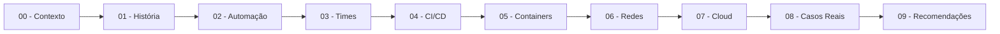

# DevOps Agile Culture - Repositório de Estudos


Repositório de estudos estruturado sobre DevOps, abordando cultura, automação, CI/CD, containers, cloud e organização de times, com base em literatura consolidada e práticas de mercado.

---

## Sobre este Repositório

Este repositório documenta minha jornada de estudos em DevOps e cultura Agile. Ele é vivo, evolui conforme aprofundo meus conhecimentos e serve tanto como base de revisão quanto como material público de aprendizado.

Natureza do conteúdo:
- Material de estudos pessoal organizado
- Em constante evolução e refinamento
- Baseado em livros, documentações oficiais e artigos técnicos
- Foco em fundamentos e práticas consolidadas

---

## Objetivos do Repositório

- Consolidar meu aprendizado em DevOps e Platform Engineering
- Criar material de revisão rápida e referência técnica
- Servir como base para projetos práticos futuros
- Demonstrar organização, documentação e visão sistêmica de DevOps
- Compartilhar conhecimento com a comunidade

---

## Estrutura do Repositório

| Arquivo | Descrição | Tópicos Principais |
|---------|-----------|-------------------|
| [00-contexto-e-definicao.md](https://github.com/JonathanFacchinetti/devops-agile-culture/blob/main/00-contexto-e-definicao.md) | Fundamentos e definições DevOps | Definição formal, CALMS, Três Caminhos, CI/CD |
| [01-historia-e-origem.md](https://github.com/JonathanFacchinetti/devops-agile-culture/blob/main/01-historia-e-origem.md) | História e evolução do movimento | Agile, Patrick Debois, DevOpsDays, Timeline 2001-2025 |
| [02-automacao-e-linux.md](https://github.com/JonathanFacchinetti/devops-agile-culture/blob/main/02-automacao-e-linux.md) | Fundamentos de automação | Shell scripting, Linux, IaC, Toil automation |
| [03-organizacao-de-times.md](https://github.com/JonathanFacchinetti/devops-agile-culture/blob/main/03-organizacao-de-times.md) | Estruturas organizacionais | Team Topologies, Platform Engineering, Anti-patterns |
| [04-pipeline-ci-cd.md](https://github.com/JonathanFacchinetti/devops-agile-culture/blob/main/04-pipeline-ci-cd.md) | Integração e entrega contínuas | CI/CD, Pipeline as Code, Métricas DORA, GitOps |
| [05-containers-e-docker.md](https://github.com/JonathanFacchinetti/devops-agile-culture/blob/main/05-containers-e-docker.md) | Containerização | Docker, Docker Compose, Multi-stage builds, Segurança |
| [06-redes-e-protocolos.md](https://github.com/JonathanFacchinetti/devops-agile-culture/blob/main/06-redes-e-protocolos.md) | Networking para DevOps | Modelo OSI/TCP-IP, DNS, SSH, Load balancing |
| [07-computacao-em-nuvem.md](https://github.com/JonathanFacchinetti/devops-agile-culture/blob/main/07-computacao-em-nuvem.md) | Cloud computing e Kubernetes | AWS/Azure/GCP, IaaS/PaaS/SaaS, K8s, Serverless |
| [08-casos-reais.md](https://github.com/JonathanFacchinetti/devops-agile-culture/blob/main/08-casos-reais.md) | Estudos de caso | Netflix, Amazon, Spotify, Etsy, Facebook |
| [09-recomendacoes-e-armadilhas.md](https://github.com/JonathanFacchinetti/devops-agile-culture/blob/main/09-recomendacoes-e-armadilhas.md) | Boas práticas e anti-patterns | Armadilhas comuns, Checklist, Roadmap de carreira |

---

## Jornada de Aprendizado



Ordem recomendada: Leitura sequencial (00 a 09) para construção progressiva de conhecimento.

---

## Stack Estudada

As tecnologias abaixo representam o escopo do conteúdo abordado. Nem todas possuem implementação prática neste momento.

Cloud Providers: AWS, Azure, GCP
Containers & Orquestração: Docker, Kubernetes
CI/CD: GitHub Actions, GitLab CI, Jenkins
Infrastructure as Code: Terraform, Ansible
Monitoramento: Prometheus, Grafana
Linguagens: Bash, Python, Go

---

## Como Usar Este Material

### Sugestão de Estudo

Ritmo recomendado:
- Leia 1 arquivo por dia ou 2-3 por semana
- Crie resumos próprios dos conceitos principais
- Teste comandos e exemplos localmente
- Reescreva exemplos em seu próprio ambiente

Pré-requisitos mínimos:
- Conhecimento básico de programação
- Familiaridade com linha de comando
- Noções de Git

Tempo estimado: 25-35 horas (leitura completa)

### Formas de Acesso

Opção 1 - Clone local:
```bash
git clone https://github.com/JonathanFacchinetti/devops-agile-culture.git
cd devops-agile-culture
```

Opção 2 - Leitura direta no GitHub:
Navegue pelos links da tabela de estrutura acima.

Opção 3 - Tópicos específicos:
Acesse diretamente o arquivo do tema desejado.

---

## Próximos Passos Técnicos

Melhorias planejadas para este repositório:

- [ ] Criar pipeline CI simples para validar Markdown
- [ ] Automatizar validação de links quebrados
- [ ] Adicionar exemplos práticos de código:
  - [ ] Pipeline CI/CD completo
  - [ ] Dockerfile multi-stage
  - [ ] Terraform básico (VPC + EC2)
  - [ ] Helm chart simples
- [ ] Laboratórios hands-on
- [ ] Exercícios de fixação por módulo

Objetivo: Evoluir de documentação teórica para repositório com implementações práticas.

---

## Principais Aprendizados Consolidados

### Fundamentos
- Cultura DevOps e framework CALMS
- História desde Agile até Platform Engineering
- Automação com Shell Script e IaC

### Práticas Core
- Team Topologies e estruturas organizacionais
- Pipelines CI/CD e métricas DORA
- Containers e Docker (boas práticas 2024-2025)

### Infraestrutura
- Networking (OSI, TCP/IP, protocolos essenciais)
- Cloud Computing (AWS, Azure, GCP)
- Kubernetes e orquestração

### Aplicação Prática
- Casos reais de empresas (Netflix, Amazon, Spotify)
- Anti-patterns e armadilhas comuns
- Roadmap de carreira DevOps

---

## Fontes e Referências

Livros base:
- "The Phoenix Project" - Gene Kim
- "The DevOps Handbook" - Gene Kim et al.
- "Team Topologies" - Matthew Skelton & Manuel Pais
- "Accelerate" - Nicole Forsgren, Jez Humble, Gene Kim
- "Site Reliability Engineering" - Google

Documentações oficiais:
- AWS Documentation
- Kubernetes Documentation
- Docker Documentation
- Terraform Documentation

Sites de referência:
- DevOps Topologies (devopstopologies.com)
- Team Topologies (teamtopologies.com)
- DevOps Roadmap (roadmap.sh/devops)

---

## Como Contribuir

Contribuições que agregam valor técnico são bem-vindas:

Tipos de contribuição aceitas:
- Correções de erros técnicos ou conceituais
- Atualizações de informações desatualizadas
- Melhorias na clareza de explicações
- Adição de referências relevantes

Processo:
1. Fork este repositório
2. Crie uma branch descritiva (`git checkout -b fix/correcao-docker`)
3. Faça commit com mensagens claras (`git commit -m 'Fix: corrige comando docker run'`)
4. Push para sua branch (`git push origin fix/correcao-docker`)
5. Abra um Pull Request explicando a mudança

---

## Licença

Este repositório está licenciado sob Creative Commons Attribution-ShareAlike 4.0 International (CC BY-SA 4.0).

Resumo da licença:
- Uso comercial permitido
- Modificação permitida
- Distribuição permitida
- Uso privado permitido
- Atribuição obrigatória
- Derivações devem usar mesma licença

---

## Informações Rápidas

Status do projeto: Em evolução contínua
Arquivos de conteúdo: 10
Última atualização: Verificar badge acima
Linguagem principal: Markdown
Público-alvo: Estudantes, desenvolvedores, profissionais em transição para DevOps

---

## Contato

**Jonathan Facchinetti**

GitHub: [@JonathanFacchinetti](https://github.com/JonathanFacchinetti)

Feedback: Issues e Pull Requests são as formas preferidas de comunicação sobre o conteúdo técnico.

---

## Agradecimentos

À comunidade DevOps pelos conteúdos públicos que tornaram este estudo possível, especialmente:
- Autores dos livros fundamentais citados
- Mantedores de documentações oficiais
- Comunidade brasileira de DevOps

---

<div align="center">

Desenvolvido como material de estudos pessoal

[Voltar ao topo](#devops-agile-culture---repositório-de-estudos)

</div>